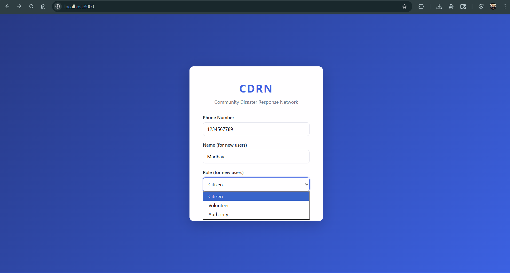
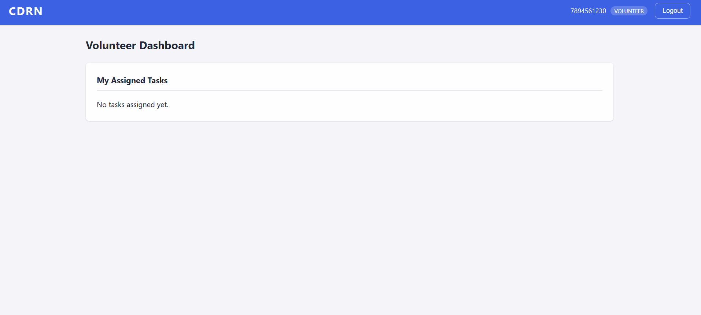

# CDRN — Community Disaster Response Network

A full-stack real-time disaster response platform with role-based dashboards for Citizens, Volunteers, and Authorities. Built with React, Spring Boot, PostgreSQL, and WebSocket (STOMP).

---

## Screenshots

### Login — Role Selection
Register with any phone number, choose your role (Citizen / Volunteer / Authority), and use OTP `123456`.



### Citizen Dashboard
Report incidents by type, description, and GPS coordinates. Send emergency SOS with one tap. Receive live broadcast alerts.


### Authority Dashboard
Full operational view: live incident map (OpenStreetMap), incident table, task assignment to volunteers, broadcast alerts, and active SOS requests.


### Volunteer Dashboard
View assigned tasks in real time. Update task status as work progresses.



---

## Architecture

```
┌─────────────┐    REST + WS    ┌──────────────┐    JPA    ┌────────────┐
│   React App │ ◄────────────► │  Spring Boot │ ◄───────► │ PostgreSQL │
│  (Port 3000)│                │  (Port 8080) │           │  (Port 5432)│
└─────────────┘                └──────────────┘           └────────────┘
```

---

## Tech Stack

| Layer     | Technology                                        |
|-----------|---------------------------------------------------|
| Frontend  | React 18, React Router v6, Axios, Leaflet         |
| Backend   | Spring Boot 3.2, Spring Security, Spring WebSocket|
| Database  | PostgreSQL 16                                     |
| Real-time | STOMP over SockJS WebSocket                       |
| Maps      | OpenStreetMap via react-leaflet                   |
| Auth      | OTP-based login with JWT tokens                   |

---

## Prerequisites

| Tool | Version |
|------|---------|
| Java (JDK) | 17+ (tested on Java 25) |
| Maven | 3.8+ |
| Node.js | 18+ |
| npm | 9+ |
| PostgreSQL | 14+ |

> **Java 25 note:** Lombok is not compatible with Java 25. The project has been migrated to plain Java (explicit getters/setters/constructors) — no Lombok dependency required at runtime.

---

## Setup & Run

### 1. PostgreSQL — Create the database

```bash
psql -U postgres
CREATE DATABASE cdrn;
\q
```

Tables are auto-created by JPA on first run (`spring.jpa.hibernate.ddl-auto=update`).

Default credentials expected by the backend (`application.properties`):

```
Host:     localhost:5432
Database: cdrn
Username: postgres
Password: postgres
```

Change these in [backend/src/main/resources/application.properties](backend/src/main/resources/application.properties) if needed.

### 2. Backend

```bash
cd backend
mvn clean install -DskipTests
mvn spring-boot:run
```

Starts on **http://localhost:8080**. First startup creates all tables automatically.

### 3. Frontend

```bash
cd frontend
npm install
npm start
```

Starts on **http://localhost:3000** and opens in the browser automatically.

---

## Authentication

Authentication is OTP-based. For development, the OTP is always **`123456`** for any phone number.

### Login flow

1. Enter phone number + name (for new accounts) + role
2. Click **Send OTP**
3. Enter `123456`
4. You are redirected to the dashboard for your role

### Role selection

When registering (first login with a phone number), select one of:

| Role | Dashboard | Capabilities |
|------|-----------|--------------|
| **CITIZEN** | `/citizen` | Report incidents, send SOS, view alerts |
| **VOLUNTEER** | `/volunteer` | View & update assigned tasks |
| **AUTHORITY** | `/authority` | Map view, assign tasks, send alerts, view SOS |

> Existing users retain their role on subsequent logins — the role selector only applies to first-time registration.

---

## API Reference

### Auth — no token required

| Method | Endpoint | Body | Description |
|--------|----------|------|-------------|
| POST | `/api/auth/send-otp` | `{ phone }` | Request OTP |
| POST | `/api/auth/verify-otp` | `{ phone, otp, name?, role? }` | Verify OTP, get JWT + user |

### Incidents — token required

| Method | Endpoint | Body | Description |
|--------|----------|------|-------------|
| POST | `/api/incident/report` | `{ type, description, latitude, longitude }` | Report incident |
| GET | `/api/incident/all` | — | List all incidents |

### SOS — token required

| Method | Endpoint | Body | Description |
|--------|----------|------|-------------|
| POST | `/api/sos/request` | `{ latitude, longitude }` | Send SOS |
| GET | `/api/sos/all` | — | List all SOS requests |

### Tasks — token required

| Method | Endpoint | Body | Description |
|--------|----------|------|-------------|
| POST | `/api/task/assign` | `{ volunteerId, incidentId }` | Assign task (AUTHORITY only) |
| PUT | `/api/task/update` | `{ taskId, status }` | Update task status (VOLUNTEER only) |
| GET | `/api/task/my` | — | Tasks for current user |
| GET | `/api/task/volunteer/{id}` | — | Tasks for a specific volunteer |

### Alerts — token required

| Method | Endpoint | Body | Description |
|--------|----------|------|-------------|
| POST | `/api/alert/send` | `{ message }` | Broadcast alert (AUTHORITY only) |
| GET | `/api/alert/all` | — | List all alerts |

### Users — token required

| Method | Endpoint | Body | Description |
|--------|----------|------|-------------|
| GET | `/api/users/volunteers` | — | List all VOLUNTEER users |
| PUT | `/api/users/{id}/role` | `{ role }` | Update user role |

---

## WebSocket

Connect to `ws://localhost:8080/ws` using SockJS + STOMP.

| Topic | Fired when |
|-------|-----------|
| `/topic/incidents` | New incident reported |
| `/topic/alerts` | Alert sent or SOS triggered |
| `/topic/tasks` | Task assigned or status updated |

---

## Project Structure

```
CDRN/
├── README.md
├── backend/
│   ├── pom.xml
│   └── src/main/
│       ├── java/com/cdrn/backend/
│       │   ├── BackendApplication.java
│       │   ├── config/
│       │   │   ├── CorsConfig.java       # CorsConfigurationSource bean
│       │   │   ├── SecurityConfig.java   # Spring Security + JWT filter chain
│       │   │   ├── JwtAuthFilter.java    # Bearer token extraction
│       │   │   ├── JwtUtil.java          # Token generation & validation
│       │   │   └── WebSocketConfig.java  # STOMP endpoint config
│       │   ├── controller/               # REST endpoints
│       │   ├── dto/                      # Request / Response DTOs
│       │   ├── model/                    # JPA entities (User, Incident, Task, Alert, SosRequest)
│       │   ├── repository/               # Spring Data JPA repositories
│       │   └── service/                  # Business logic
│       └── resources/
│           └── application.properties
└── frontend/
    ├── package.json
    └── src/
        ├── App.js                  # Router + protected routes
        ├── api.js                  # Axios instance with JWT interceptor
        ├── websocket.js            # STOMP WebSocket client
        ├── context/AuthContext.js  # Auth state (token, user, login/logout)
        ├── pages/
        │   ├── Login.js            # Two-step OTP login with role selector
        │   ├── CitizenDashboard.js
        │   ├── VolunteerDashboard.js
        │   └── AuthorityDashboard.js
        ├── components/
        │   ├── IncidentForm.js     # Report incident form
        │   ├── IncidentList.js     # Incident table
        │   ├── IncidentMap.js      # Leaflet map with markers
        │   ├── SOSButton.js        # One-tap SOS
        │   ├── TaskList.js         # Volunteer task list
        │   ├── TaskAssignForm.js   # Assign task (Authority)
        │   ├── AlertList.js        # Live alert feed
        │   └── Navbar.js
        └── styles/App.css
```

---

## Quick Test Flow

1. Start PostgreSQL, backend, and frontend
2. Open **http://localhost:3000**

**As Authority:**
- Phone: `1111111111`, Name: `Arnav`, Role: `Authority`, OTP: `123456`
- View the incident map, assign tasks, send alerts

**As Citizen:**
- Phone: `2222222222`, Name: `Madhav`, Role: `Citizen`, OTP: `123456`
- Report an incident (e.g. type: FLOOD, add coordinates)
- Press the SOS button — the Authority dashboard updates in real time
- Alerts sent by Authority appear in the Live Alerts section

**As Volunteer:**
- Phone: `3333333333`, Role: `Volunteer`, OTP: `123456`
- After the Authority assigns a task, it appears here instantly via WebSocket
- Update task status to mark progress
